# FALYS

FALYS is a lightweight file-integrity / insider-threat monitoring system with a **server + agent** architecture, similar in shape to Wazuh, CrowdStrike Falcon, or Elastic Security — a central dashboard that ingests file-activity events from endpoint agents, scores them for risk, correlates them into incidents, and alerts on the ones that matter.

It's built to be easy to stand up on a single LAN (a lab, a small office, a university department) without external infrastructure: no DNS server, no message broker, no cloud dependency. Agents find the server automatically even when both are on DHCP, and endpoints run a single compiled binary with no Python installation required.

## Contents

- [Architecture](#architecture)
- [Key features](#key-features)
- [How detection works](#how-detection-works)
- [Screenshots](#screenshots)
- [Getting started](#getting-started)
- [Configuration](#configuration)
- [Dashboard pages](#dashboard-pages)
- [API reference](#api-reference)
- [Deploying agents](#deploying-agents)
- [Security notes](#security-notes)
- [Testing](#testing)
- [Known limitations](#known-limitations)
- [Further reading](#further-reading)

## Architecture

```
falys/
├── server/               Flask dashboard + event API (the "manager")
│   ├── server.py         Entry point, routes, event ingestion
│   ├── engine/           5-stage detection pipeline (see below)
│   ├── discovery.py      LAN broadcast discovery (server side)
│   ├── auth.py           Dashboard login / session handling
│   ├── risk_rules_store.py     Admin-editable scoring rules
│   ├── engine_config_store.py  Admin-editable engine weights/thresholds
│   ├── agent_keys_store.py     Per-agent API key issuance/revocation
│   ├── agent_generator.py      Legacy Python-source agent packages
│   ├── deployment_builder.py   Packages compiled agent binaries
│   ├── email_service.py  Gmail SMTP alert delivery
│   ├── tls_utils.py       Self-signed cert generation / TLS setup
│   ├── templates/         Dashboard pages (Jinja2)
│   ├── static/             CSS/JS assets
│   ├── logs/                Runtime data: events, settings, certs, secrets
│   └── tests/
├── agent/                Endpoint agent (the "sensor")
│   ├── agent.py           Watches a directory, sends events to the server
│   ├── discovery.py       LAN broadcast discovery (agent side)
│   ├── attribution.py     Resolves the *real* user behind a file event
│   ├── windows_service.py Windows Service wrapper (compiled into .exe)
│   ├── linux_service.py    systemd wrapper (compiled into the Linux binary)
│   ├── config.json        Per-deployment server address + credentials
│   └── tests/
└── docs/
    ├── DYNAMIC_IP_DISCOVERY.md
    ├── DETECTION_ENGINE.md
    ├── ATTRIBUTION_SETUP.md
    └── AGENT_DEPLOYMENT.md
```

## Key features

- **File-activity monitoring** — agents watch a configured directory (via `watchdog`) and report create/modify/delete/permission-change events.
- **5-stage detection engine** — combines deterministic rules, per-host behavioral anomaly detection, and event correlation into a single confidence-scored classification (see below).
- **LAN auto-discovery** — server and agents find each other by UDP broadcast, so neither side needs a hardcoded IP; both sides authenticate the exchange with a shared discovery token so a random device answering on the port can't spoof the server.
- **Verified user attribution** — instead of trusting the OS process user, FALYS cross-checks file events against `auditd` (Linux) or the Security event log (Windows) to attribute activity to the account that actually touched the file, and clearly labels events as "Verified" or "Unverified" rather than guessing.
- **TLS by default** — the server generates its own self-signed certificate on first run; agents pin that exact certificate rather than relying on a public CA chain (appropriate for a LAN-only deployment).
- **Per-agent API keys** — each deployed agent gets its own key, issued and revocable independently from the dashboard, instead of one shared secret for the whole fleet.
- **No-Python endpoints** — agents ship as a single compiled binary per platform (`FalysAgent.exe` / `falys-agent`) that self-installs as a Windows Service / systemd unit: download, run once, done.
- **Live dashboard** — event history, timeline, alerts, detections (with expandable reasons + confidence), agent fleet management, and admin-editable risk rules/engine tuning, all updating in real time over Server-Sent Events.

## How detection works

Every event that hits `/log` passes through `server/engine/`:

1. **Context Collection** — gathers facts: is this host/user new, is it business hours, is this host tagged critical, etc.
2. **Rule-Based Risk Scoring** — deterministic checks (sensitive-path globs, event-type baseline severity, permission changes, burst frequency), admin-editable from the dashboard.
3. **Behavioral Anomaly Detection** — builds a per-host statistical baseline (events/minute, hour-of-day activity) and flags deviations from *that host's own history*, plus "first time seen" novelty flags.
4. **Event Correlation** — groups related events in a sliding time window per host (bursts, staged tampering patterns like permission-loosen → touch → delete, cross-host activity by the same attributed user) into `INC-xxxxxxxxxx` incident records.
5. **Confidence-Based Classification** — combines the three signals (admin-tunable weights) into a 0–100 risk score, a tier (Legitimate / Low Risk / Suspicious / High Risk / Critical), and a separate confidence value.

Each stage is fault-isolated: if one stage errors on bad input, it degrades to a safe default rather than blocking ingestion. Legacy `severity`-based alerting is untouched, so existing email alerts keep working exactly as before.

## Screenshots

> Images below assume a `screenshots/` folder at the repo root (`screenshots/1.png` … `screenshots/13.png`, plus `screenshots/12.1.png`). Adjust the paths/extensions if your repo lays them out differently.

### Login

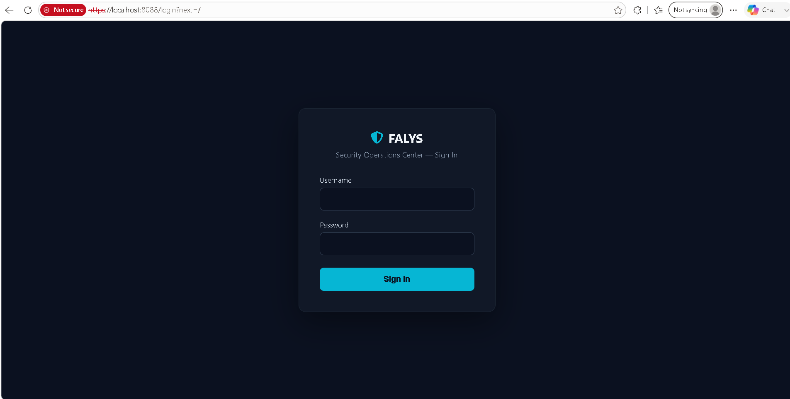

### Home

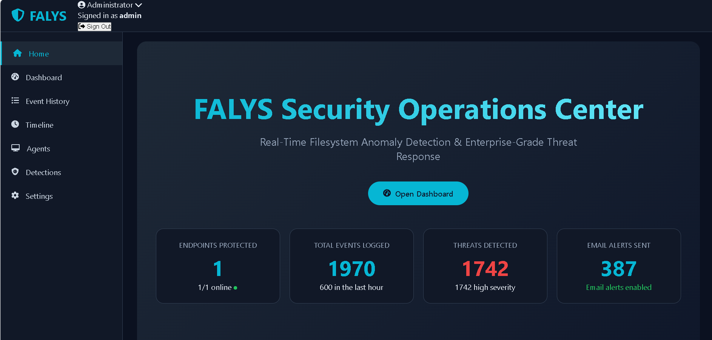

### Dashboard

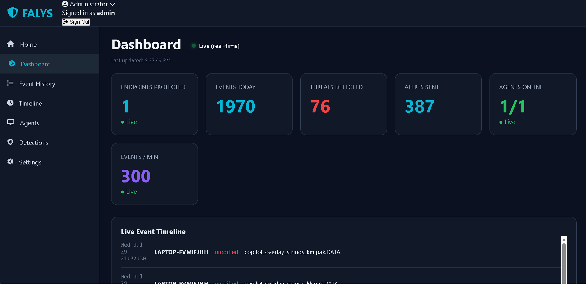
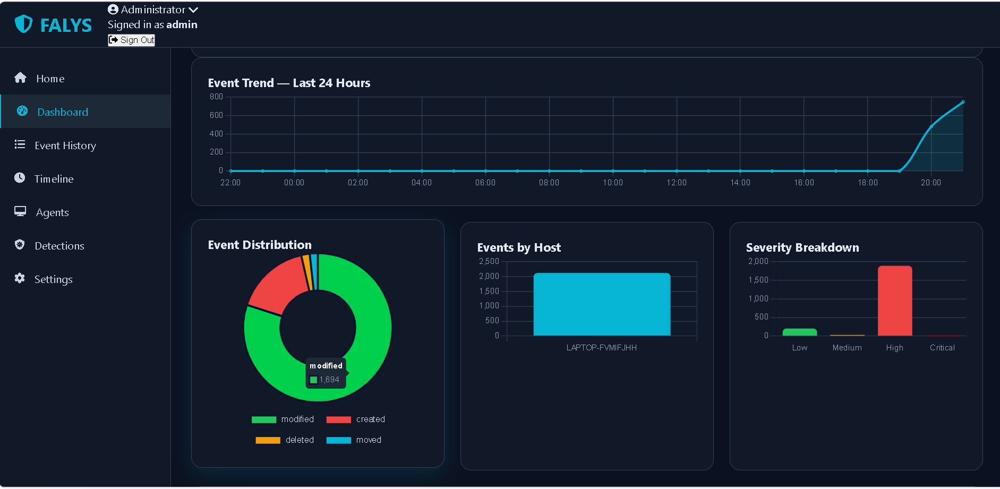
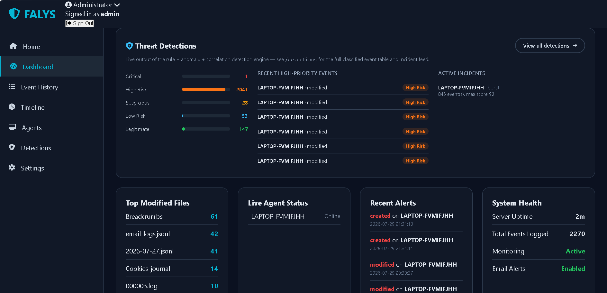

### Event History

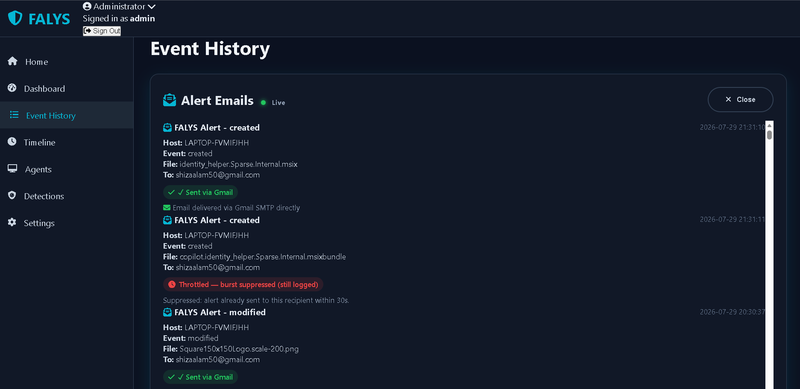
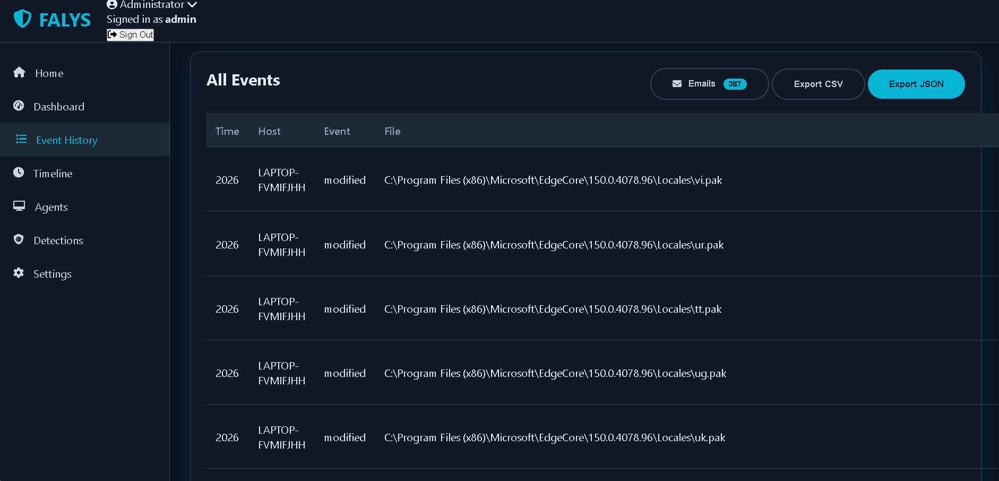

### Activity Timeline

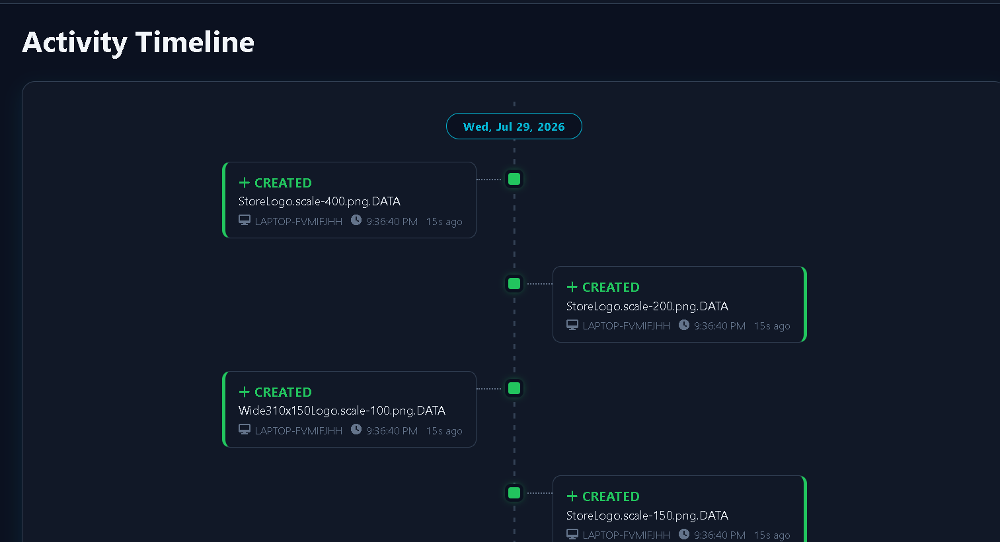
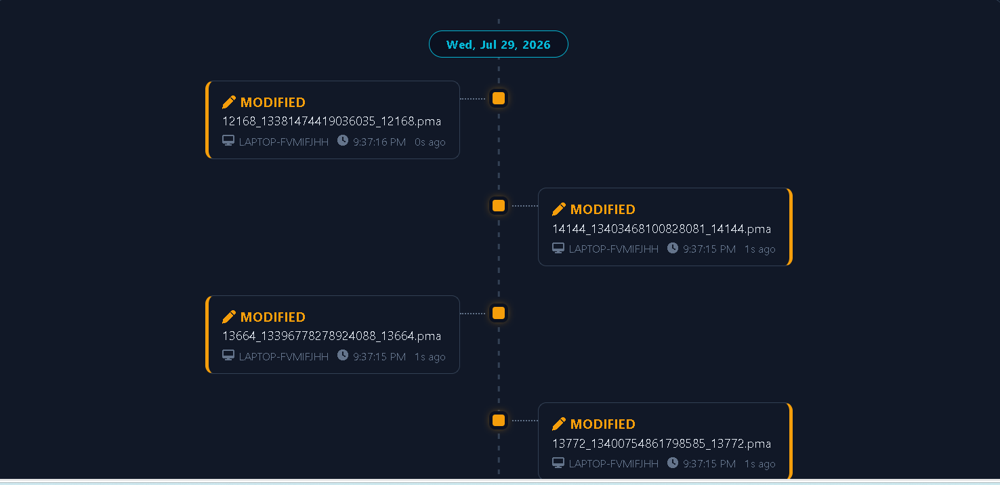
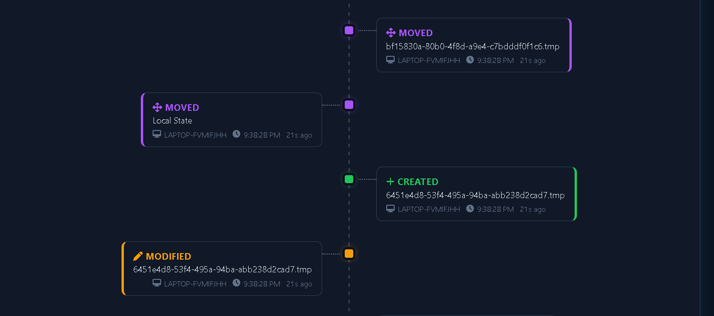

### Agents

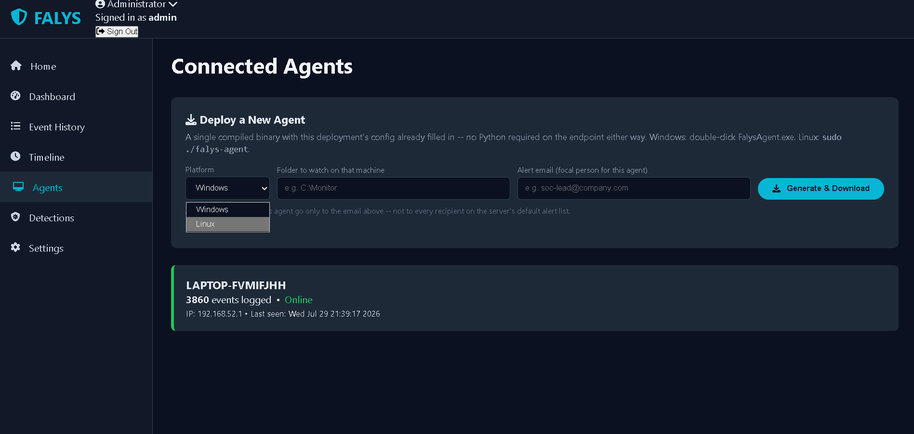

### Detections

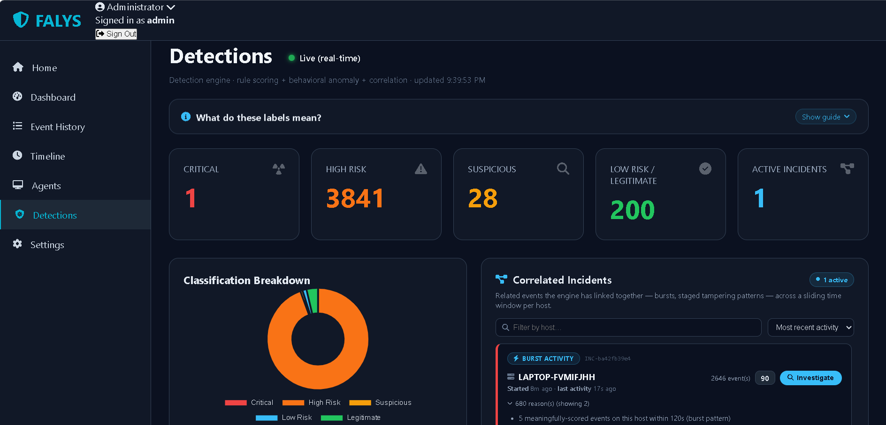
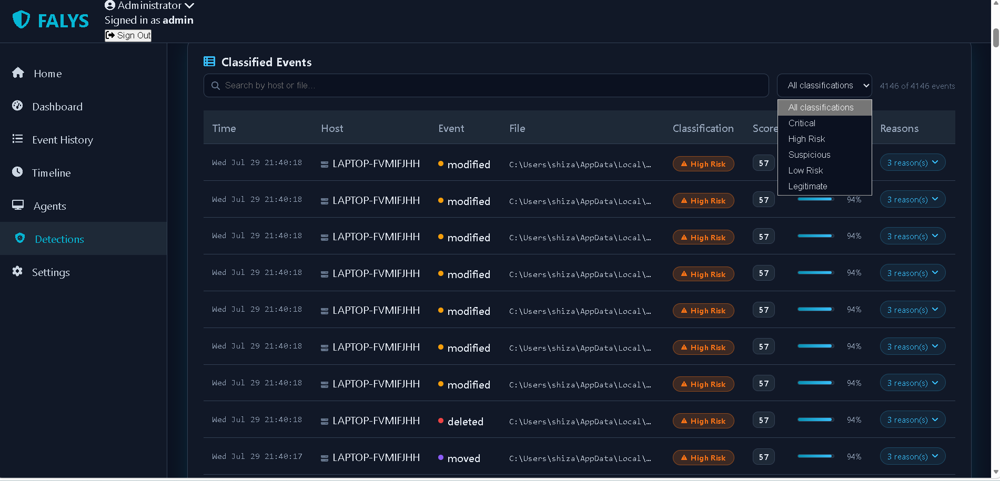

### System Settings

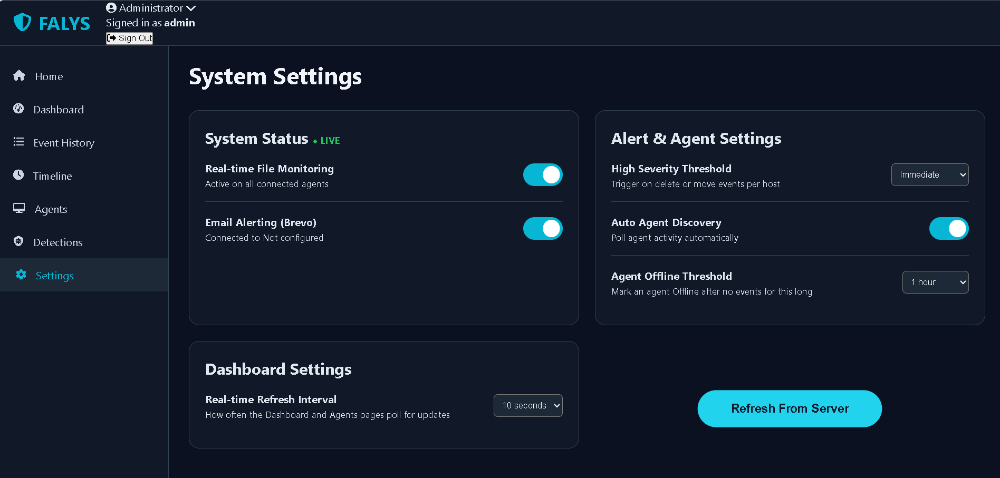

## Getting started

### Prerequisites

- Python 3.9+ on the machine that will run the server, and on any machine building an agent binary
- Endpoints themselves need **no** Python if you deploy the compiled agent binaries (see [Deploying agents](#deploying-agents))

### 1. Run the server

```bash
cd server
pip install -r requirements.txt
python3 server.py
```

On first run FALYS generates an admin password and a LAN discovery token if you haven't set them yourself, prints them once to the console, and persists them to `logs/generated_secrets.json` for restarts. Set them explicitly via the environment (see [Configuration](#configuration)) for anything beyond a local test.

The dashboard is served over HTTPS at `https://<server-ip>:8088` by default (self-signed certificate, generated automatically under `logs/certs/` on first run).

### 2. Add an agent (development / testing)

For quick local testing without building a binary:

```bash
cd agent
pip install -r requirements.txt
python3 agent.py
```

`config.json` needs a `server` URL, `watch_dir`, and the `api_key` / `discovery_token` issued for that agent. In normal use you don't hand-edit this file — the dashboard's **Agents** page generates a ready-to-run package (binary + `config.json` + pinned `cert.pem`) per agent.

### 3. Production deployment

See [Deploying agents](#deploying-agents) below for the compiled-binary flow, which is what the dashboard uses by default.

## Configuration

The server reads configuration from the environment (or from a git-ignored `server/.env` file, loaded automatically). Nothing sensitive ships with a default value that authenticates anything real.

| Variable | Purpose | Default if unset |
|---|---|---|
| `FALYS_HTTP_PORT` | Dashboard/API port | `8088` |
| `FALYS_ADMIN_USERNAME` | Dashboard login username | `admin` |
| `FALYS_ADMIN_PASSWORD` | Dashboard login password | auto-generated, printed once, persisted to `logs/generated_secrets.json` |
| `FALYS_SECRET_KEY` | Flask session signing key | random per process (sessions don't survive a restart unless set) |
| `FALYS_DISCOVERY_TOKEN` | Shared secret for LAN discovery auth | auto-generated, persisted |
| `FALYS_TLS_ENABLED` | Serve over HTTPS | `1` (set to `0` only for a throwaway local test) |
| `FALYS_TLS_CERT` / `FALYS_TLS_KEY` | Path to a real CA-issued cert/key, if you have one | self-signed, auto-generated |
| `FALYS_GMAIL_SENDER` / `FALYS_GMAIL_APP_PASSWORD` | Gmail SMTP credentials for alert emails | unset — alerts log as skipped until configured |
| `FALYS_ALERT_RECIPIENTS` | Comma-separated alert email recipients | unset |
| `FALYS_SENDER_NAME` | Display name on alert emails | `FALYS` |
| `FALYS_BREVO_API_KEY` | Legacy, currently unused by the active email path | unset |

> Per-agent API keys and each agent's pinned TLS certificate are issued automatically when you generate a deployment package from the dashboard — they aren't environment variables.

## Dashboard pages

| Page | Purpose |
|---|---|
| `/` | Home |
| `/dashboard` | Overview / stats |
| `/history` | Full event log |
| `/timeline` | Chronological event view |
| `/detections` | Classified events (risk tier, confidence, reasons) + correlated incidents |
| `/alerts` | Redirects into History — the dedicated Alerts page was retired; email/alert history now lives in History's email panel |
| `/agents` | Fleet management: view, revoke keys, generate deployment packages |
| `/settings` | Risk rules, engine tuning, email/alert configuration |

## API reference

| Route | Method | Purpose |
|---|---|---|
| `/health` | GET | Liveness + discovery-auth check |
| `/log` | POST | Agent event ingestion (requires `X-API-Key`) |
| `/api/stream` | GET | Server-Sent Events feed for live dashboard updates |
| `/api/agents` | GET | List known agents |
| `/api/agent-keys` | GET | List issued agent keys |
| `/api/agent-keys/<key_id>/revoke` | POST | Revoke a single agent's key |
| `/api/generate-agent/<platform>` | POST | Legacy Python-source agent package |
| `/api/generate-agent/windows-exe` | POST | Compiled Windows agent package (falls back to a build kit if no binary has been built yet) |
| `/api/generate-agent/linux-bin` | POST | Compiled Linux agent package (same fallback behavior) |
| `/api/risk-rules` | GET/POST | Read/patch rule-scoring config |
| `/api/engine-config` | GET/POST | Read/patch detection-engine weights/thresholds |
| `/api/incidents` | GET | Recent correlated incidents |
| `/api/stats` | GET | Severity + classification breakdowns |
| `/api/email-logs` | GET | Alert email delivery history |

## Deploying agents

Endpoints run a single compiled binary — no Python, no `pip install`:

- **Windows**: download the generated package, unzip, double-click `FalysAgent.exe`, accept one admin prompt. It applies the required audit policy, registers itself as a Windows Service, and starts monitoring immediately and on every subsequent boot.
- **Linux**: download, unzip, `sudo ./falys-agent`. It applies the auditd policy, installs to `/opt/falys-agent`, and enables a systemd service the same way.

Building the binary itself is a one-time step run by an admin on a matching OS (PyInstaller doesn't cross-compile):

```bash
# Windows, in an elevated PowerShell prompt, once:
cd agent
.\build_exe.ps1

# Linux, once:
cd agent
./build_exe_linux.sh
```

Drop the resulting binary into `server/build_output/`. After that, every "Generate & Download" click on the **Agents** page is instant — it just zips the existing binary with a fresh `config.json` and pinned `cert.pem`. Until a platform's binary has been built, that platform's button instead returns a source + build-script "build kit" so the flow is never a dead end.

If you need `.msi` for a software-push tool (SCCM/Intune/GPO), wrap the already-working `FalysAgent.exe` in a thin WiX or Inno Setup installer whose only job is to lay the exe + `config.json` down and run it once.

## Security notes

- **Rotate anything that ever left your machine.** `server/.env` and `server/run_falys.sh` are git-ignored on purpose because they can hold a live Gmail sender address and app password — if either file is ever copied, zipped, or uploaded anywhere (including to a chat or file-sharing tool), treat that credential as compromised and generate a fresh one at `myaccount.google.com` → Security → App Passwords.
- Auto-generated secrets (`FALYS_ADMIN_PASSWORD`, `FALYS_DISCOVERY_TOKEN`) are fine for a local test but should be set explicitly via the environment for any real deployment.
- The discovery protocol never transmits the shared token itself — only a one-way hash of it — so packet-sniffing the LAN doesn't reveal it. It still only proves "this device knows the token," not identity beyond that.
- The self-signed server certificate is pinned by each agent at package-generation time. If the server's certificate is ever regenerated (deleted, or its IP changes enough that the old cert's SAN list no longer covers it), redeploy affected agents to pick up the new `cert.pem` — their uploads will queue locally rather than fail silently in the meantime.
- Each agent has its own revocable API key; a compromised endpoint can be cut off from the dashboard without rotating credentials for the rest of the fleet.

## Testing

```bash
# Discovery / agent-generation regression tests
python3 server/tests/test_discovery_fix.py

# Attribution parsing (auditd / Windows Security log formats)
python3 agent/tests/test_attribution.py
```

Both suites run without a live server, endpoint, or OS audit subsystem present — they test the pure logic against representative sample data.

## Known limitations

- **LAN discovery is single-broadcast-domain only.** It won't cross routed subnets/VLANs without a relay; agents on other subnets need the server's address configured another way (e.g. internal DNS).
- **Single-process, in-memory state.** Fine at the scale of dozens to low hundreds of agents on one server; scaling to thousands means moving event storage off JSONL, moving the engine's per-host state to Redis, and running behind a real WSGI server (see `docs/DETECTION_ENGINE.md` for the full scaling checklist).
- Windows Object Access auditing only fires on monitored access rights (write, delete, permission change) — a plain directory listing won't generate an attribution record.
- The Windows/Linux compiled-binary flows have been tested against sample data and reviewed carefully, but haven't been run end-to-end against a live Windows machine or a live systemd host in this environment — do one real smoke test per platform before rolling out to many endpoints.

## Further reading

- `docs/DYNAMIC_IP_DISCOVERY.md` — how server/agent auto-discovery and re-discovery works
- `docs/DETECTION_ENGINE.md` — full detection pipeline design and scaling notes
- `docs/ATTRIBUTION_SETUP.md` — enabling and verifying OS-level user attribution
- `docs/AGENT_DEPLOYMENT.md` — compiled-binary deployment, TLS, and service install details
